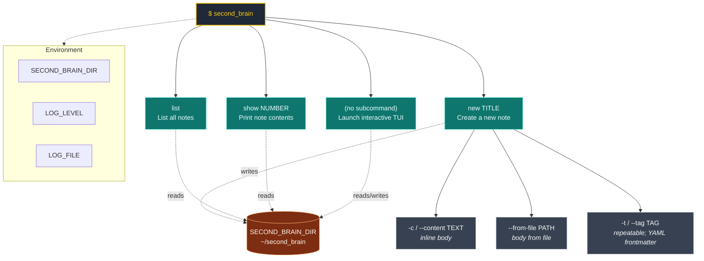

# Commands

A visual overview of the `second_brain` CLI surface: subcommands, their
options, the filesystem store they read or write, and the environment
variables that configure them.

The source of the diagram is also available as a standalone Mermaid file
at [`commands.mmd`](commands.mmd) for editing in Mermaid tools.
